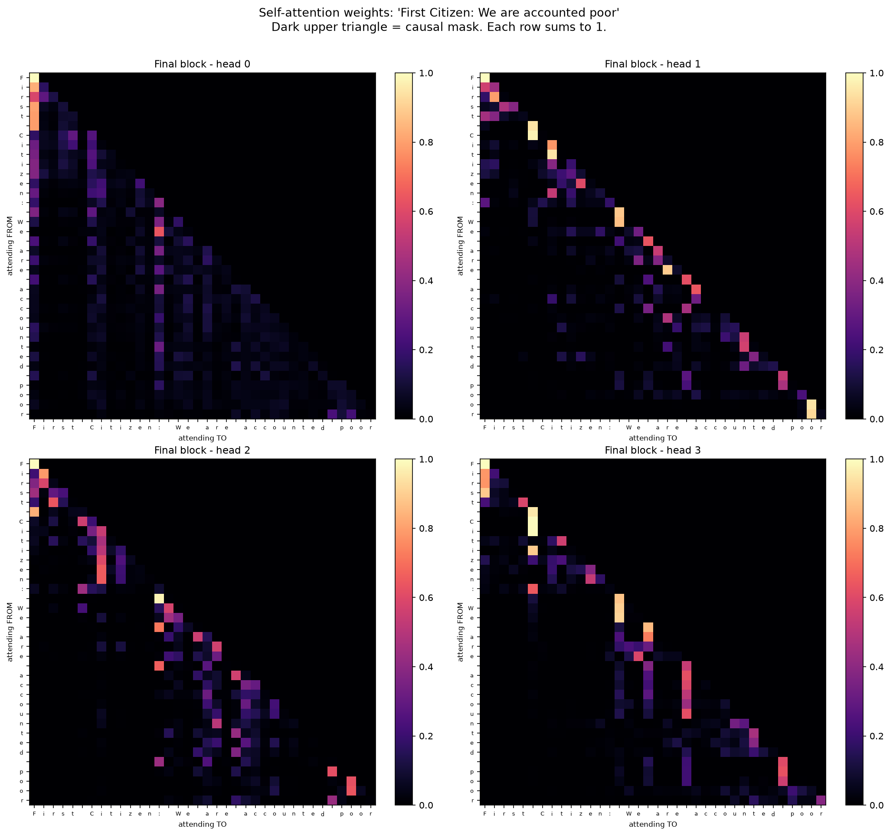

# Transformers From Scratch

A two-part, code-first walkthrough of how a transformer actually works — from turning text into integers, to a small working GPT you can train in a few minutes.

Everything runs in Google Colab. No GPU required (though it helps).



*Attention weights from the final block of the model built in Part 2, reading the prompt "First Citizen: We are accounted poor". The dark upper triangle is the causal mask — no position may attend to the future. Each head has learned a different pattern.*

---

## Notebooks

| | Notebook | Open |
|---|---|---|
| **Part 1** | **Tokenization** — character vs word vs subword, BPE implemented from scratch, then `tiktoken` and `SentencePiece` compared side by side | [](https://colab.research.google.com/github/jino-shaji/transformer-from-scratch/blob/main/notebooks/01_tokenization_sentencepiece_and_tiktoken.ipynb) |
| **Part 2** | **Bigram → Transformer** — build a bigram model, watch it fail, fix it with self-attention, end with a small GPT | [](https://colab.research.google.com/github/jino-shaji/transformer-from-scratch/blob/main/notebooks/02_bigram_to_transformer.ipynb) |

### 📖 The written series

1. [How a Transformer Actually Works](https://www.kodeoverflow.com/post/ai/how-a-transformer-actually-works) — one attention calculation, worked by hand
2. [How Text Becomes Numbers](https://www.kodeoverflow.com/post/ai/how-text-becomes-numbers) — SentencePiece vs tiktoken, and the multilingual token tax
3. [From a Bigram Model to a Working Transformer](https://www.kodeoverflow.com/post/ai/bigram-to-transformer) — build it, watch it fail, fix it

---

## What you'll build

**Part 1 — Tokenization**

- Character-level and word-level tokenizers, and why both are bad
- Byte-Pair Encoding implemented in ~20 lines, watching it discover `low`, `st` and whole frequent words on its own
- `tiktoken`: byte-level BPE, the tokenizer behind GPT-3.5/4/4o
- `SentencePiece`: trainable, language-agnostic, BPE and Unigram modes
- A measurement of the token cost of non-English text — the same sentence in English, Hindi, Malayalam and Japanese

**Part 2 — The model**

- A bigram language model, trained and generating (badly, for an instructive reason)
- Self-attention verified by hand on a 2-word, 2-dimensional example
- Causal masking, and why the future has to be hidden
- Multi-head attention, feed-forward layers, residual connections, layer norm
- Positional embeddings
- A 0.82M parameter GPT trained on Tiny Shakespeare
- Two figures generated from your own run: the attention heatmap above, and a loss curve comparing the bigram against the transformer

---

## Running locally

```bash
git clone https://github.com/jino-shaji/transformer-from-scratch.git
cd transformer-from-scratch
pip install -r requirements.txt
jupyter notebook
```

## Requirements

```
torch
tiktoken
sentencepiece
matplotlib
```

Part 2 downloads Tiny Shakespeare (~1 MB) on first run.

---

## Credits

The bigram → transformer progression follows the approach popularised by Andrej Karpathy's *Let's build GPT* and [nanoGPT](https://github.com/karpathy/nanoGPT), reorganised here around a hand-verifiable attention example and paired with a tokenization deep-dive.

Architecture from Vaswani et al., [*Attention Is All You Need*](https://arxiv.org/abs/1706.03762) (2017).

## License

MIT